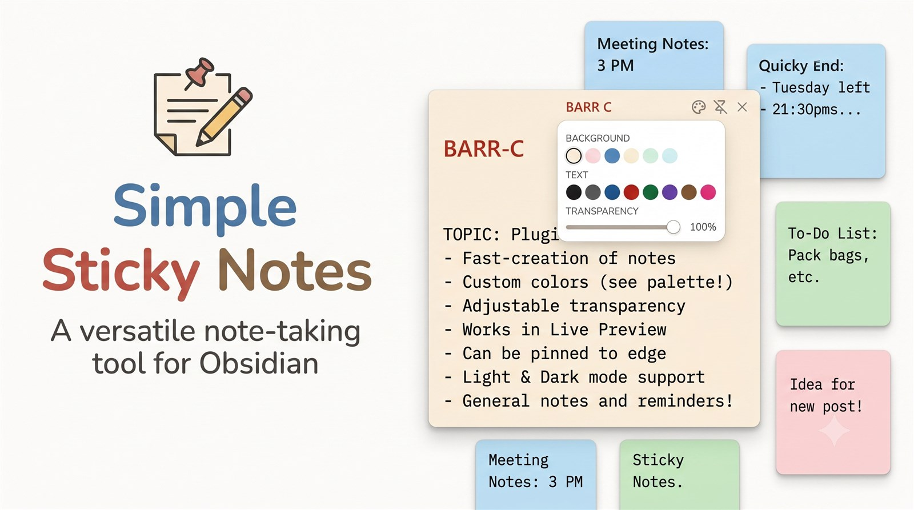

# Simple Sticky Notes

Floating sticky-note windows for Obsidian — pin, colors, opacity, text colors, and workspace restore.

Open a sticky note from the ribbon, command palette, or file context menu.

## Installation

### Community plugins (after approval)

1. Open **Settings → Community plugins → Browse**
2. Search for **Simple Sticky Notes**
3. Install and enable

### Manual

1. Download `main.js`, `manifest.json`, and `styles.css` from the [latest release](https://github.com/rephila/simple-sticky-notes/releases/latest)
2. Put them in `<vault>/.obsidian/plugins/simple-sticky-notes/`
3. Reload Obsidian and enable the plugin

## Commands

- Open sticky note
- Create sticky note
- Destroy all sticky notes

## Settings

- New sticky note folder
- Restore open sticky notes (position, size, colors, transparency)
- Show in taskbar
- Default pin mode
- Default window size / resizable
- Default transparency
- Background colors (same palette as on the note)
- Text colors (same palette as on the note)
- Save appearance to note frontmatter

## Support

If you find this useful:

- [GitHub Sponsors](https://github.com/sponsors/rephila)
- [Buy Me a Coffee](https://buymeacoffee.com/rephila)
- [PayPal](https://www.paypal.com/donate/?hosted_button_id=VAC4CJ8QQ8VQL)

## Limitations

- Requires Obsidian **1.13.0+** (declarative settings API)
- Desktop only — uses Electron APIs for pin, opacity, and window sizing
- Relies on Obsidian popout / header DOM structure, which may change in future Obsidian versions

## License

GNU Affero General Public License v3.0 — see [LICENSE](LICENSE).
